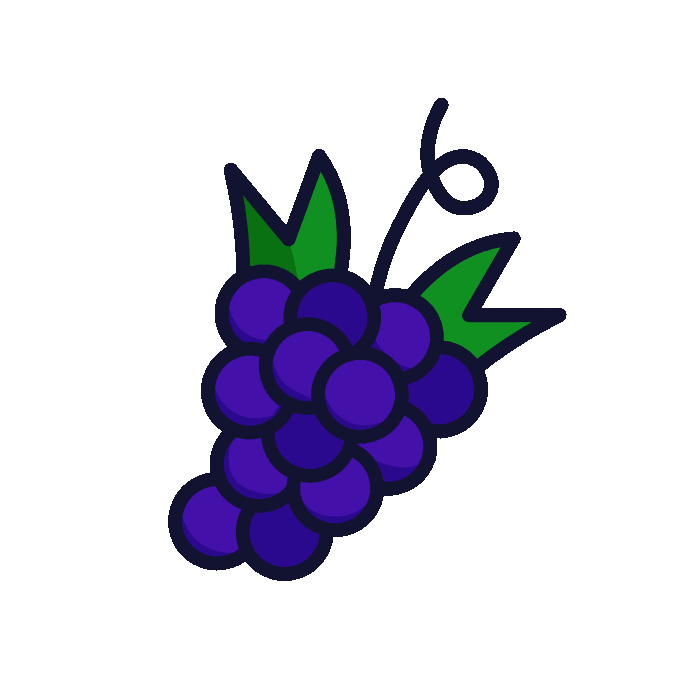
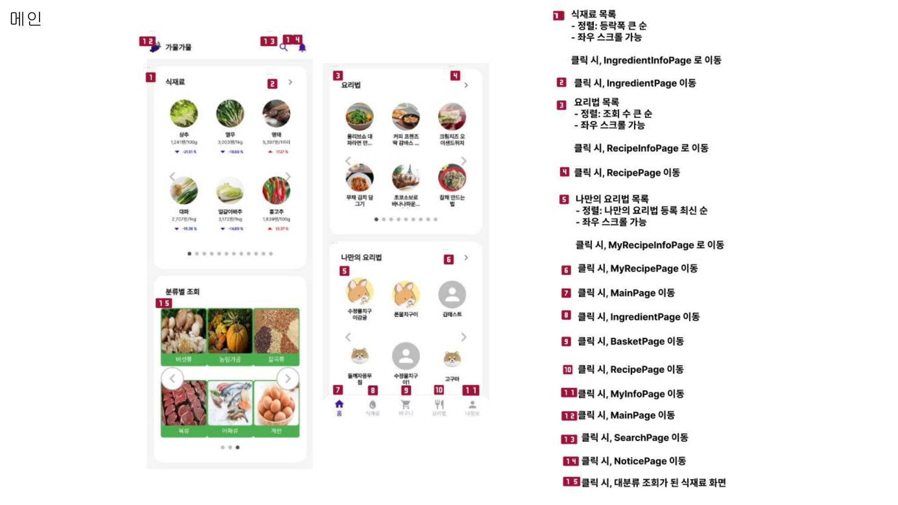
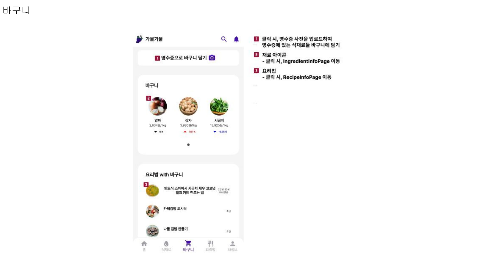
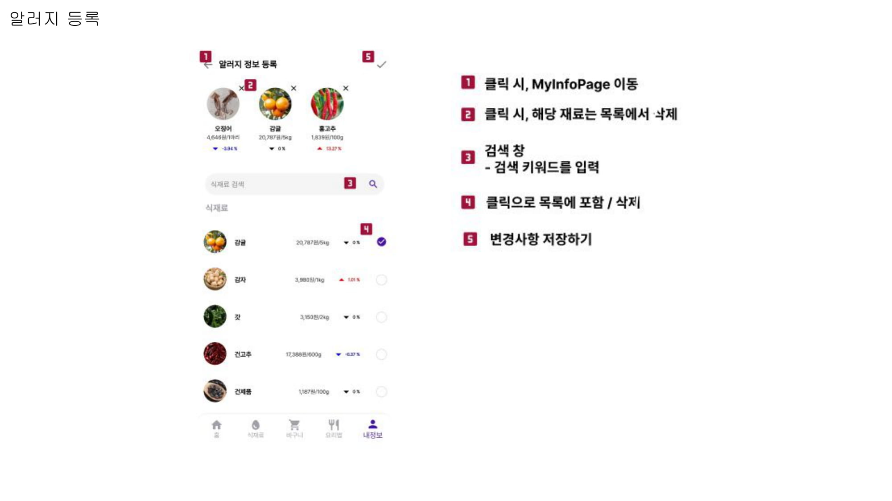
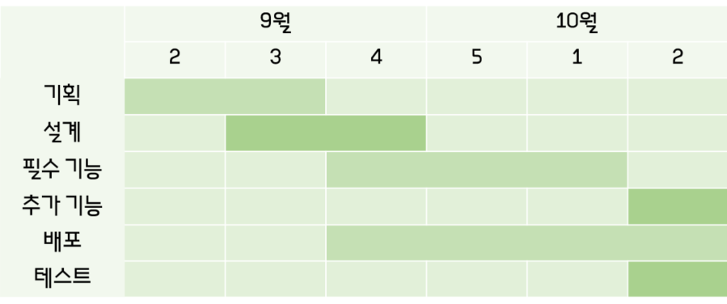
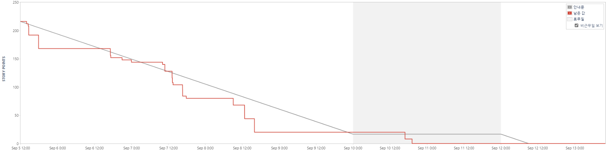

  <h5 style="font-weight: bold;">↑ GIF 파일을 클릭하면 UCC를 볼 수 있어요!</h5>
   
   

# 목차

1. [**서비스 소개**](#1)
2. [**기획 배경**](#2)
3. [**기능 소개**](#3)
4. [**기술 스택**](#4)
5. [**프로젝트 일정 및 산출물**](#5)
6. [**개발 멤버 및 회고**](#6)

 

---

 

# 🍎 서비스 소개

## 서비스 설명

### 개요

- 한줄 소개 : 물가 정보 & 요리법 조회 서비스
- 서비스 명 : **`가물가물`**

### 타겟 🎯

- 식탁 물가에 민감한 주부들
- 식재료 원가를 일 단위로 파악하고 싶은 자영업자들
- 오늘은 뭘 먹을지 고민하는 자취생들

# 🍌 기획 배경

## 목적 🥅

**식재료의 가격 변동과 요리법을 한눈에 확인하자**

## 의의

- 물가 변동을 확인하여 최저가 구매 루트를 확인할 수 있다.
- 나만의 요리법 등록으로 필요한 식재료들의 가격변동을 한눈에 확인할 수 있다.
- 식재료를 검색하고, 관련된 요리법을 조회할 수 있다.

# 🌽 기능 소개

# 🍩 기술 스택

## 문자열 유사도 알고리즘

15만개의 레시피에서 제각각의 식재료들이 존재하기 때문에, 문자열 유사도 알고리즘을 통해 매핑 과정 진행.

### 편집거리 Jaro 알고리즘

두 문자열이 같아지려면 몇 번의 문자 조작이 필요한지 구하는 알고리즘

## 하둡 (High Availability Distributed Object Oriented Platform: 고가용성 분산형 객체 지향적 플랫폼)

Apache Hadoop은 오픈 소스, Java 기반 소프트웨어 플랫폼으로 빅데이터 애플리케이션용 데이터 처리와 스토리지를 관리하는 역할.

하둡 플랫폼은 컴퓨터 클러스터 내 여러 노드에 걸쳐 하둡 빅데이터와 분석 작업을 분배하며, 그 과정에서 작업을 병렬식으로 실행 가능한 작은 크기의 워크로드로 분해.

### 하둡의 필요성

약 2.8억개의 데이터를 조회할 때, 하둡을 사용하지 않으면 25.69s의 시간이 소요되지만, 하둡을 적용하면 654ms로 단축할 수 있음.

## 하이브

하이브는 하둡 에코시스템 중에서 데이터를 모델링하고 프로세싱하는 경우 가장 많이 사용하는 데이터 웨어하우징용 솔루션.

RDB의 데이터베이스, 테이블과 같은 형태로 HDFS에 저장된 데이터의 구조를 정의하는 방법을 제공하며, 이 데이터를 대상으로 SQL과 유사한 HiveQL 쿼리를 이용하여 데이터를 조회하는 방법을 제공.

## PWA

인터넷 웹사이트의 파일들(html, javascript, css 등)을 캐싱해놨다가 다시 요청이 올 때 캐싱된 파일들을 먼저 보여주고 필요할 떄 웹서버에 있는 데이터를 받아서 보여주는 기술.

또 홈에 바로 가기 아이콘을 설치 할 수 있어 사용자는 모바일 앱과 같은 사용자 경험을 제공할 수 있음.

# 🍆 프로젝트 일정 및 산출물

## 프로젝트 일정

## 프로젝트 진행
### 1. Git flow
---
Git flow 사용을 위해 `sourcetree` 프로그램을 사용하였고 우아한 형제들의 [git flow](https://techblog.woowahan.com/2553/)을 참고.

front 와 back 으로 나누어 `faature`의 하위 브랜치를 사용하였으며 매일 오전 스크럼 이후 `back` 브랜치와 `front` 브랜치로 merge 하여 사용.
 

`commit message`는 `feat(기능명): 내용` 과 같이 통일하여 작성. 

   

### 2. Jira
---
매주 월요일 오전 회의에서 금주의 진행 이슈를 백로그에 등록.

전주에 완료하지 못한 이슈나, 앞으로 진행할 이슈들을 추가함.
- 에픽은 회원, 미팅, 설계 등으로 구성.
- 레이블은 BE, FE, full 으로 구성.
- 스토리는 명확한 전달을 위하여 `API 명세서 작성`와 같이 작성.
- 작업현황을 실시간으로 지라에 반영하여 현재 팀원이 어떤 작업을 하고있는지, 일정에 딜레이가 있는지 한 눈에 알아볼 수 있게 함.
 

## 프로젝트 산출물
### 1. Figma
- 모바일

- 데스크탑

 

### 2. ERD

 

### 3. API 문서

# 🍟 개발 멤버 및 회고

- [민경욱](https://github.com/rrkcl7733) : Hadoop Ecosystem을 처음 구축해본 프로젝트였습니다. 3주차 중간발표 이후에 ubunto 가상환경을 재설치하는 이슈가 있었습니다. Hive를 Tez engine으로 사용하여 했지만 원활하지 않았던게 이유였습니다. 개발 중간단계에서 환경 재설치라는 큰 결심을 하면서 프로젝트의 마무리를 잘 해낼 수 있을까 걱정했었지만 시행착오를 겪으며 더 탄탄해지는 느낌을 받았습니다. Linux 환경과 HDFS에 저장하는 모든 경험들이 처음이었지만 실패를 반복했던 것이 결국에는 더 좋은 영향으로 돌아왔다는 것을 실감했습니다. 프로젝트 후반에선 Sqoop을 사용하여 HDFS와 RDB를 연동하는 방법을 알았고 실제 적용되는 마지막 단계를 보며 만족스러웠습니다.
- [김찬영](https://github.com/letgodchan0) : 데이터가 많이 필요한 프로젝트였기 때문에 수집하고 정제하는 것이 중요했습니다. 특히나 3억건 가까이 되는 데이터를 DB에 직접 넣고 백엔드 서버와 연동하기 위해 분산 처리 기술을 사용했던 것이 프로젝트에서 가장 중요한 부분이었습니다. 이번 프로젝트에서는 데이터 수집 및 정제, 그리고 백엔드 서버를 주로 맡아서 개발을 진행했습니다. Spring boot를 사용한 2번째 프로젝트였는데, 이전보다 JPA 사용에 익숙해질 수 있었고, Spring boot에서 외부 API 연동, 패키지 관리 등을 진행했습니다. 또한 API와 크롤링을 통해 하둡으로 데이터가 쌓이고 하둡 서버에서 데이터를 정제하고 DB에 적재하는 파이프라인을 개발하는 경험을 해볼 수 있었습니다.
- [이지나](https://github.com/dlwlsk0428) : 가물가물을 작업하며 기존에 있던 기술에 대한 이해도를 높이는 동시에 새로운 여러 기술들을 접할 수 있었습니다. MySQL과 JPA에 대한 이해가 높아졌으며, JWT에 대해 심도 있게 공부할 수 있었습니다. OCR 적용, MySQL과 Spring 스케줄링, Docker, Jenkins와 같은 신기술 적용 과정을 통해 큰 보람을 느낄 수 있었습니다. OCR을 통한 영수증 스캔과 스케줄링을 이용해 특정 시간마다 특정 조건에 맞는 사용자에게 알림을 보내는 기능이 성공했을 때도 뿌듯했지만, 서버 및 자동 배포 환경 구축에 성공하여 수정사항이 생길 때마다 이뤄졌던 번거로운 작업 과정을 크게 단축했을 때가 가장 뿌듯했습니다.
 팀원들과 함께한 두 번째 프로젝트인데, 팀원들 모두 첫 번째 프로젝트에서보다 더 발전된 모습을 보여주었던 것 같습니다. 마감 시기에 맞춰 밤새워가며 완성도를 높여가는 모습에 큰 고마움을 느꼈습니다. 특히 새로운 기술 사용에 있어 매우 적극적인 태도를 보여줘서 긍정적인 자극을 받을 수 있었습니다. 덕분에 당당하게 내놓을 수 있는 프로젝트를 만들 수 있었던 것 같습니다. 가물가물 팀원들 모두 모두 고생하셨고 늘 행복했으면 좋겠습니다~!!!
- [이주영](https://github.com/2weeks0) : Next.js를 학습하고 프로젝트에 적용해보면서 SSR의 위대함을 몸소 느껴보는 좋은 경험이였습니다. 또, 반응형 UI와 PWA를 활용해 어느 환경에서도 쉽게 사용할 수 있는 웹 앱을 개발해보며 운영체제를 타지 않는 웹 앱의 장점과 모바일 앱과 비교되는 한계도 느낄 수 있었습니다. 수상을 기대하지 않았지만 팀원들이 열심히 해준 덕분에 좋은 상까지 받을 수 있던 것 같고, 7주 동안 고생한 팀원들에게 고맙다는 말을 전하고 싶습니다. 다음 프로젝트도 꼭 좋은 결과물을 만들어내 3개의 프로젝트 모두 수상하고 싶습니다! 가즈아ㅏㅏㅏㅏㅏㅏㅏㅏㅏㅏㅏㅏㅏㅏㅏㅏㅏㅏㅏㅏ
- [정건우](https://github.com/abcxj123) : React를 사용한 두 번째 프로젝트여서 그런지 이전에 비해 CSS와 많이 친해져 컴포넌트를 자유자재로 다룰 수 있어서 좋았습니다. 하지만 Next.JS를 처음 적용해보는 과정에서 이전 방식과 많이 달라 어려움이 있었고, 서비스를 반응형 웹으로 제공하기 위해 화면 설계를 PC, Tablet, Mobile 버전으로 모두 만들어야 했기에 작업량이 생각보다 많아 일정이 빠듯했습니다.
특히 이번에는 기획 및 설계 단계에 시간을 많이 투자하여 실제 개발 시간이 적었는데, 팀원들과 이야기를 나누며 늦게까지 남아 개발한 결과, 기간 내에 모든 기능을 구현할 수 있었습니다. 물가, 주변 마트 데이터를 시각화하여 보여주기 위해 Kakao Map API와 Apex-charts 라이브러리를 사용했는데, 가물가물 서비스에 필요한 형태로 조금씩 바꿔가면서 적용한 것이 좋은 경험이 된 것 같습니다.
이번 프로젝트는 팀원 모두 시간에 쫓겨 힘들었을텐데, 끝까지 마무리 하느라 고생했다고 해주고 싶습니다. 자율 프로젝트도 다같이 열심히 해보자~~
- [채윤선](https://github.com/younsunchae) : 모바일 서비스를 제작해본건 처음이였는데, 모바일이 사용자 경험이 더 직관적으로 느껴진다는 점에 새로웠습니다. 또, PWA를 적용하며 반응형 UI로 제작하였는데, 프로젝트를 진행하며 어떻게 UI를 배치하여야 사용자 입장에서 편리할지 고민해보는 과정이 즐거웠습니다.  다양한 사용자 경험을 위해 애니메이션 아이콘을 적용하고 싶었는데, 라이브러리를 잘못 고른 실수 덕에 고생했던 경험도 예쁘게 잘 만들어진 화면을 보니 그저 기쁘기만 합니다!! 저희 팀원들 덕분에 해보고 싶었던 기술들 잔뜩 적용해볼 수 있었습니다~~! 우리 팀원들 최고야 ~ 자율은 더 멋있게 해